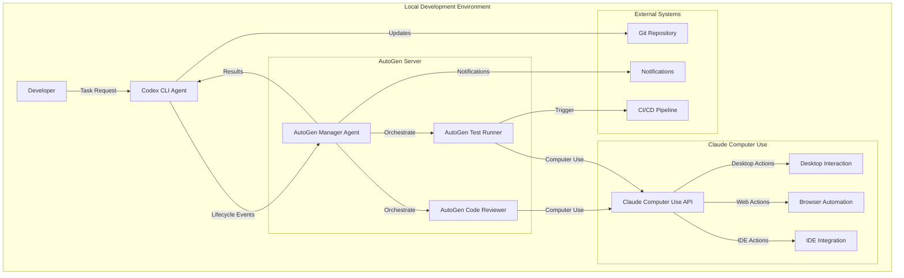
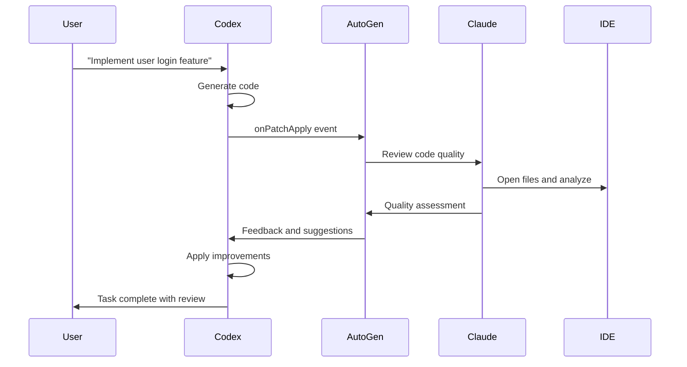
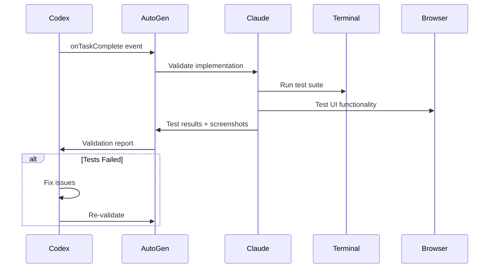

# Codex-AutoGen-Claude Integration Architecture Overview

## Executive Summary

This document outlines the architecture for integrating Codex CLI with Microsoft AutoGen and Claude Computer Use to create a sophisticated multi-agent system. The integration leverages Codex's existing lifecycle hooks system to trigger AutoGen workflows that can orchestrate Claude Computer Use for automated code review, testing, and validation.

## System Architecture

### High-Level Components



### Core Principles

1. **Event-Driven Architecture**: Leverages Codex lifecycle hooks for seamless integration
2. **Agent Autonomy**: Each agent operates independently with clear responsibilities
3. **Computer Use Integration**: Claude can interact with the desktop environment for comprehensive validation
4. **Fail-Safe Design**: System continues to function even if integration components fail
5. **Extensible Framework**: Easy to add new agents and capabilities

## Agent Responsibilities

### 1. Codex CLI Agent (Primary)
- **Role**: Code generation and task execution
- **Responsibilities**:
  - Execute user-requested coding tasks
  - Generate and apply code patches
  - Run commands and manage file operations
  - Emit lifecycle events for integration points
  - Receive feedback and implement corrections

### 2. AutoGen Manager Agent (Orchestrator)
- **Role**: Workflow orchestration and decision making
- **Responsibilities**:
  - Receive Codex lifecycle events via hooks
  - Analyze task context and determine review requirements
  - Orchestrate multi-agent workflows
  - Coordinate between different specialist agents
  - Aggregate results and provide feedback to Codex
  - Manage escalation and error handling

### 3. AutoGen Code Reviewer Agent (Specialist)
- **Role**: Code quality and best practices validation
- **Responsibilities**:
  - Review generated code for quality, security, and best practices
  - Check adherence to coding standards and conventions
  - Identify potential bugs and performance issues
  - Suggest improvements and optimizations
  - Validate documentation and comments

### 4. AutoGen Test Runner Agent (Specialist)
- **Role**: Testing and validation automation
- **Responsibilities**:
  - Execute existing test suites
  - Generate and run new tests for new code
  - Validate functionality and edge cases
  - Check test coverage and quality
  - Report test results and failures

### 5. Claude Computer Use Agent (Executor)
- **Role**: Desktop interaction and comprehensive validation
- **Responsibilities**:
  - Interact with IDEs for code analysis
  - Run applications and test user interfaces
  - Perform browser-based testing
  - Execute complex validation workflows
  - Capture screenshots and evidence
  - Interact with development tools

## Integration Points

### 1. Lifecycle Hook Integration

Codex lifecycle hooks trigger AutoGen workflows at key points:

```yaml
# Codex configuration
lifecycleHooks:
  enabled: true
  hooks:
    onTaskStart:
      script: "./hooks/autogen-task-start.sh"
      async: true
    onTaskComplete:
      script: "./hooks/autogen-review.sh"
      async: false
      filter:
        customExpression: "eventData.success === true"
    onPatchApply:
      script: "./hooks/autogen-code-review.sh"
      async: true
      filter:
        fileExtensions: ["ts", "js", "py", "java", "go"]
    onCommandComplete:
      script: "./hooks/autogen-test-validation.sh"
      filter:
        commands: ["npm test", "pytest", "go test"]
        exitCodes: [0]
```

### 2. Communication Protocols

#### HTTP API Communication
- **Codex → AutoGen**: RESTful API calls via lifecycle hooks
- **AutoGen → Claude**: Computer Use API integration
- **AutoGen → Codex**: Webhook callbacks for results

#### Event Data Format
```json
{
  "eventType": "task_complete",
  "sessionId": "uuid",
  "timestamp": "2024-01-01T12:00:00Z",
  "context": {
    "task": "Implement user authentication",
    "model": "claude-3-5-sonnet",
    "workingDirectory": "/path/to/project",
    "files": ["src/auth.ts", "tests/auth.test.ts"],
    "success": true,
    "duration": 45000
  },
  "metadata": {
    "linesAdded": 150,
    "linesDeleted": 5,
    "testsAdded": 8,
    "complexity": "medium"
  }
}
```

## Workflow Examples

### 1. Code Generation and Review Workflow



### 2. Test Validation Workflow



## Benefits

### 1. Enhanced Code Quality
- **Automated Review**: Every code change gets reviewed by specialized agents
- **Best Practices**: Consistent application of coding standards
- **Security Validation**: Automated security vulnerability detection
- **Performance Analysis**: Identification of performance bottlenecks

### 2. Comprehensive Testing
- **Automated Test Generation**: AI-generated tests for new functionality
- **UI Testing**: Visual validation of user interfaces
- **Integration Testing**: End-to-end workflow validation
- **Regression Prevention**: Automated detection of breaking changes

### 3. Developer Productivity
- **Reduced Manual Review**: Automated first-pass code review
- **Faster Feedback**: Immediate validation and suggestions
- **Learning Integration**: Developers learn from AI feedback
- **Quality Assurance**: Higher confidence in generated code

### 4. Workflow Automation
- **CI/CD Integration**: Seamless integration with existing pipelines
- **Documentation Generation**: Automated documentation updates
- **Deployment Validation**: Pre-deployment verification
- **Monitoring Integration**: Automated monitoring setup

## Technical Requirements

### Infrastructure
- **AutoGen Server**: Local or containerized AutoGen installation
- **Claude API Access**: Anthropic API key and Computer Use access
- **Network Connectivity**: HTTP/HTTPS communication between components
- **Resource Requirements**: Sufficient CPU/memory for multi-agent operations

### Dependencies
- **Codex CLI**: Latest version with lifecycle hooks support
- **Microsoft AutoGen**: v0.2+ with multi-agent support
- **Claude Computer Use**: API access and desktop permissions
- **Development Tools**: IDEs, browsers, terminal access

### Security Considerations
- **API Key Management**: Secure storage and rotation of API keys
- **Network Security**: Encrypted communication between components
- **Access Control**: Limited permissions for computer use operations
- **Audit Logging**: Comprehensive logging of all agent interactions

## Implementation Phases

### Phase 1: Basic Integration (2-3 weeks)
- Set up AutoGen server with basic manager agent
- Implement Codex lifecycle hook scripts
- Create simple code review workflow
- Basic HTTP API communication

### Phase 2: Claude Computer Use (3-4 weeks)
- Integrate Claude Computer Use API
- Implement desktop interaction capabilities
- Add IDE integration for code analysis
- Create screenshot and evidence capture

### Phase 3: Advanced Workflows (4-5 weeks)
- Multi-agent orchestration
- Complex validation workflows
- UI testing automation
- Performance analysis integration

### Phase 4: Production Readiness (2-3 weeks)
- Error handling and resilience
- Monitoring and observability
- Security hardening
- Documentation and training

## Success Metrics

### Quality Metrics
- **Code Review Coverage**: % of code changes reviewed by AI
- **Bug Detection Rate**: Issues caught before deployment
- **Test Coverage**: Automated test coverage improvements
- **Security Vulnerability Detection**: Security issues identified

### Performance Metrics
- **Review Latency**: Time from code generation to review completion
- **False Positive Rate**: Incorrect suggestions from AI reviewers
- **Developer Satisfaction**: Feedback on AI assistance quality
- **Productivity Improvement**: Reduction in manual review time

### Reliability Metrics
- **System Uptime**: Availability of integration components
- **Error Rate**: Failed integration attempts
- **Recovery Time**: Time to recover from failures
- **Scalability**: Performance under increased load

## Future Enhancements

### Advanced AI Capabilities
- **Multi-modal Analysis**: Image and video analysis of UIs
- **Natural Language Queries**: Voice-activated code review
- **Predictive Analysis**: Anticipating potential issues
- **Learning Integration**: Continuous improvement from feedback

### Extended Integrations
- **Multiple IDE Support**: VS Code, IntelliJ, Vim integration
- **Cloud Platform Integration**: AWS, Azure, GCP deployment validation
- **Database Integration**: Schema validation and migration testing
- **API Testing**: Automated API endpoint testing

### Workflow Enhancements
- **Custom Agent Creation**: User-defined specialist agents
- **Workflow Templates**: Pre-built workflows for common tasks
- **Integration Marketplace**: Community-contributed integrations
- **Analytics Dashboard**: Comprehensive metrics and insights

---

This architecture provides a robust foundation for creating a sophisticated multi-agent development environment that enhances code quality, automates testing, and improves developer productivity through intelligent automation.
