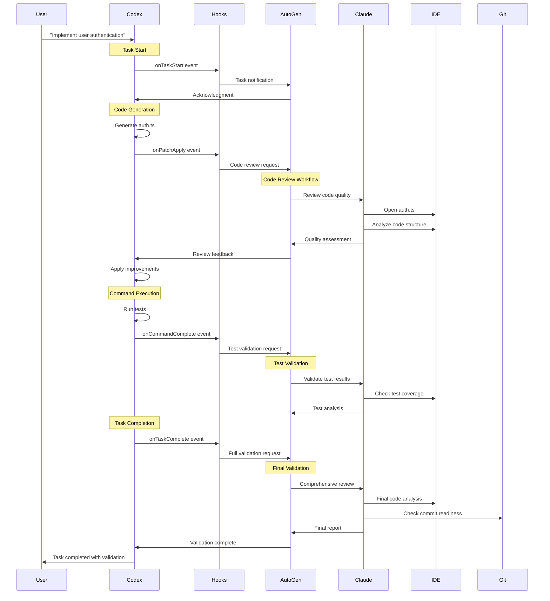
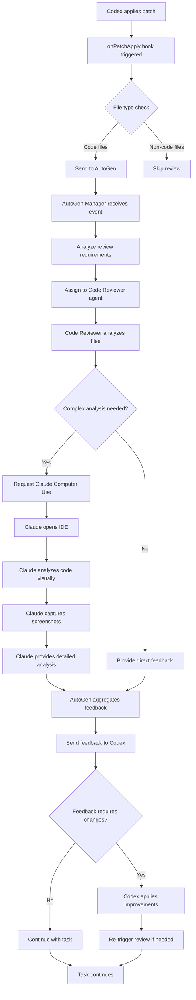
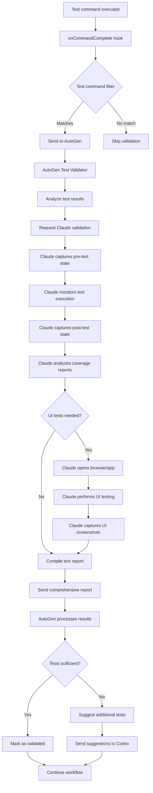

# Event Flow and Data Flow Specification

## Overview

This document details the event flow and data exchange patterns between Codex CLI, AutoGen, and Claude Computer Use components in the integrated multi-agent system.

## Event Flow Diagrams

### 1. Complete Task Execution Flow



### 2. Code Review Workflow Detail



### 3. Test Validation Flow



## Data Flow Specifications

### 1. Event Data Structures

#### Base Event Structure
```typescript
interface CodexEvent {
  eventType: 'task_start' | 'task_complete' | 'task_error' | 
             'command_start' | 'command_complete' | 'patch_apply' |
             'agent_message' | 'agent_reasoning' | 'mcp_tool_call';
  sessionId: string;
  timestamp: string; // ISO 8601
  context: EventContext;
  metadata?: EventMetadata;
}

interface EventContext {
  model: string;
  workingDirectory: string;
  eventData: Record<string, unknown>;
  task?: string;
  files?: string[];
  success?: boolean;
  duration?: number;
}

interface EventMetadata {
  linesAdded?: number;
  linesDeleted?: number;
  testsAdded?: number;
  complexity?: 'low' | 'medium' | 'high';
  riskLevel?: 'low' | 'medium' | 'high';
}
```

#### Specific Event Types

##### Task Start Event
```json
{
  "eventType": "task_start",
  "sessionId": "uuid-123",
  "timestamp": "2024-01-01T12:00:00Z",
  "context": {
    "model": "claude-3-5-sonnet",
    "workingDirectory": "/path/to/project",
    "task": "Implement user authentication system",
    "eventData": {
      "userPrompt": "Create a secure login system with JWT tokens",
      "estimatedComplexity": "medium",
      "requiredFiles": ["auth.ts", "middleware.ts", "tests/auth.test.ts"]
    }
  }
}
```

##### Patch Apply Event
```json
{
  "eventType": "patch_apply",
  "sessionId": "uuid-123",
  "timestamp": "2024-01-01T12:05:00Z",
  "context": {
    "model": "claude-3-5-sonnet",
    "workingDirectory": "/path/to/project",
    "files": ["src/auth.ts", "src/types.ts"],
    "eventData": {
      "patchContent": "diff --git a/src/auth.ts...",
      "changeType": "feature_addition",
      "affectedFunctions": ["login", "validateToken", "refreshToken"]
    }
  },
  "metadata": {
    "linesAdded": 85,
    "linesDeleted": 3,
    "complexity": "medium",
    "riskLevel": "medium"
  }
}
```

##### Command Complete Event
```json
{
  "eventType": "command_complete",
  "sessionId": "uuid-123",
  "timestamp": "2024-01-01T12:10:00Z",
  "context": {
    "model": "claude-3-5-sonnet",
    "workingDirectory": "/path/to/project",
    "success": true,
    "duration": 15000,
    "eventData": {
      "command": ["npm", "test"],
      "exitCode": 0,
      "stdout": "Tests: 15 passed, 15 total",
      "stderr": "",
      "testResults": {
        "totalTests": 15,
        "passedTests": 15,
        "failedTests": 0,
        "coverage": 85.5
      }
    }
  }
}
```

### 2. AutoGen Request/Response Formats

#### Review Request
```json
{
  "requestType": "code_review",
  "requestId": "req-uuid-456",
  "sessionId": "uuid-123",
  "priority": "normal",
  "context": {
    "files": ["src/auth.ts", "src/types.ts"],
    "reviewCriteria": {
      "security": true,
      "performance": true,
      "bestPractices": true,
      "documentation": true
    },
    "codeContext": {
      "language": "typescript",
      "framework": "express",
      "testFramework": "jest"
    }
  },
  "options": {
    "useComputerVision": true,
    "generateScreenshots": true,
    "deepAnalysis": false
  }
}
```

#### Review Response
```json
{
  "requestId": "req-uuid-456",
  "status": "completed",
  "timestamp": "2024-01-01T12:15:00Z",
  "results": {
    "overallScore": 8.5,
    "findings": [
      {
        "type": "security",
        "severity": "medium",
        "file": "src/auth.ts",
        "line": 45,
        "message": "Consider using bcrypt with higher salt rounds",
        "suggestion": "Increase salt rounds from 10 to 12 for better security",
        "code": "const hash = await bcrypt.hash(password, 10);"
      },
      {
        "type": "performance",
        "severity": "low",
        "file": "src/auth.ts",
        "line": 78,
        "message": "Database query could be optimized",
        "suggestion": "Add index on email field for faster lookups"
      }
    ],
    "screenshots": [
      {
        "description": "IDE showing auth.ts with highlighted security issue",
        "base64": "iVBORw0KGgoAAAANSUhEUgAA..."
      }
    ],
    "metrics": {
      "codeQuality": 8.5,
      "security": 7.5,
      "performance": 9.0,
      "maintainability": 8.0
    }
  },
  "agentInfo": {
    "primaryReviewer": "CodeReviewer",
    "assistants": ["ClaudeProxy"],
    "reviewDuration": 45000
  }
}
```

### 3. Claude Computer Use Integration

#### Computer Use Request
```json
{
  "action": "review_code_in_ide",
  "parameters": {
    "files": ["src/auth.ts"],
    "ide": "vscode",
    "tasks": [
      "open_file",
      "analyze_structure",
      "check_imports",
      "validate_types",
      "capture_screenshots"
    ]
  },
  "context": {
    "workingDirectory": "/path/to/project",
    "expectedIdeState": "project_loaded"
  }
}
```

#### Computer Use Response
```json
{
  "status": "completed",
  "actions_performed": [
    {
      "action": "screenshot",
      "timestamp": "2024-01-01T12:12:00Z",
      "description": "Initial IDE state"
    },
    {
      "action": "click",
      "coordinates": [150, 200],
      "description": "Opened file explorer"
    },
    {
      "action": "type",
      "text": "src/auth.ts",
      "description": "Navigated to auth file"
    },
    {
      "action": "screenshot",
      "timestamp": "2024-01-01T12:12:30Z",
      "description": "Auth file opened in editor"
    }
  ],
  "analysis": {
    "code_structure": "Well organized with clear separation of concerns",
    "potential_issues": [
      "Line 45: Hardcoded salt rounds",
      "Line 78: Unoptimized database query"
    ],
    "suggestions": [
      "Move configuration to environment variables",
      "Add database indexing"
    ]
  },
  "evidence": [
    {
      "type": "screenshot",
      "base64": "iVBORw0KGgoAAAANSUhEUgAA...",
      "description": "Code showing security issue on line 45"
    }
  ]
}
```

## Event Processing Patterns

### 1. Asynchronous Event Processing

```python
import asyncio
from typing import Dict, Any, List
import aiohttp
import logging

class EventProcessor:
    def __init__(self):
        self.event_queue = asyncio.Queue()
        self.processing_tasks = []
        
    async def process_events(self):
        """Main event processing loop"""
        while True:
            try:
                event = await self.event_queue.get()
                task = asyncio.create_task(self.handle_event(event))
                self.processing_tasks.append(task)
                
                # Clean up completed tasks
                self.processing_tasks = [t for t in self.processing_tasks if not t.done()]
                
            except Exception as e:
                logging.error(f"Error processing event: {e}")
                
    async def handle_event(self, event: Dict[str, Any]):
        """Handle individual event"""
        event_type = event.get("eventType")
        
        if event_type == "patch_apply":
            await self.handle_code_review(event)
        elif event_type == "command_complete":
            await self.handle_test_validation(event)
        elif event_type == "task_complete":
            await self.handle_full_validation(event)
```

### 2. Event Filtering and Routing

```python
class EventRouter:
    def __init__(self):
        self.filters = {
            "code_review": self.code_review_filter,
            "test_validation": self.test_validation_filter,
            "full_validation": self.full_validation_filter
        }
        
    def code_review_filter(self, event: Dict[str, Any]) -> bool:
        """Filter for code review events"""
        if event.get("eventType") != "patch_apply":
            return False
            
        files = event.get("context", {}).get("files", [])
        code_extensions = {".ts", ".js", ".tsx", ".jsx", ".py", ".java", ".go"}
        
        return any(
            any(file.endswith(ext) for ext in code_extensions)
            for file in files
        )
        
    def test_validation_filter(self, event: Dict[str, Any]) -> bool:
        """Filter for test validation events"""
        if event.get("eventType") != "command_complete":
            return False
            
        command = event.get("context", {}).get("eventData", {}).get("command", [])
        test_commands = {"npm test", "pytest", "go test", "cargo test"}
        
        return any(
            " ".join(command).startswith(test_cmd)
            for test_cmd in test_commands
        )
```

### 3. Error Handling and Recovery

```python
class ErrorHandler:
    def __init__(self):
        self.retry_counts = {}
        self.max_retries = 3
        
    async def handle_with_retry(self, event: Dict[str, Any], handler_func):
        """Handle event with retry logic"""
        event_id = event.get("sessionId", "unknown")
        retry_count = self.retry_counts.get(event_id, 0)
        
        try:
            result = await handler_func(event)
            # Reset retry count on success
            self.retry_counts.pop(event_id, None)
            return result
            
        except Exception as e:
            if retry_count < self.max_retries:
                self.retry_counts[event_id] = retry_count + 1
                logging.warning(f"Retrying event {event_id}, attempt {retry_count + 1}")
                await asyncio.sleep(2 ** retry_count)  # Exponential backoff
                return await self.handle_with_retry(event, handler_func)
            else:
                logging.error(f"Max retries exceeded for event {event_id}: {e}")
                return {"status": "failed", "error": str(e)}
```

## Performance Considerations

### 1. Event Batching
- Group related events to reduce API calls
- Batch file reviews when multiple files change
- Aggregate test results for comprehensive reporting

### 2. Caching Strategies
- Cache Claude Computer Use screenshots
- Store agent analysis results for similar code patterns
- Cache IDE state to reduce setup time

### 3. Resource Management
- Limit concurrent Claude Computer Use sessions
- Queue events during high load periods
- Implement circuit breakers for external services

This event flow specification ensures reliable, efficient communication between all components while maintaining system resilience and performance.
