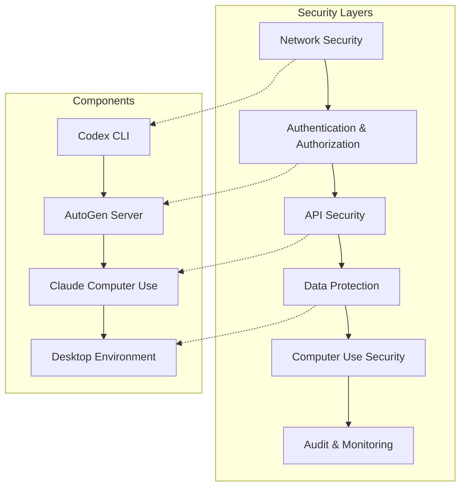

# Security Considerations: Codex-AutoGen-Claude Integration

## Overview

This document outlines comprehensive security considerations, threat models, and mitigation strategies for the integrated multi-agent system comprising Codex CLI, Microsoft AutoGen, and Claude Computer Use.

## Security Architecture

### Defense in Depth Strategy



## Threat Model

### 1. Attack Vectors

#### External Threats
- **API Key Compromise**: Unauthorized access to AI services
- **Man-in-the-Middle**: Interception of communications
- **Injection Attacks**: Malicious code injection through events
- **Denial of Service**: Resource exhaustion attacks
- **Data Exfiltration**: Unauthorized access to code and data

#### Internal Threats
- **Privilege Escalation**: Unauthorized system access
- **Code Tampering**: Malicious modifications to generated code
- **Configuration Manipulation**: Unauthorized changes to system settings
- **Audit Log Tampering**: Covering tracks of malicious activity

#### Computer Use Specific Threats
- **Desktop Takeover**: Unauthorized control of user desktop
- **Screen Recording**: Unauthorized capture of sensitive information
- **Application Manipulation**: Malicious interaction with applications
- **File System Access**: Unauthorized file operations

### 2. Threat Actors

#### External Actors
- **Malicious Hackers**: Seeking to compromise systems or steal data
- **Competitors**: Industrial espionage and intellectual property theft
- **Nation-State Actors**: Advanced persistent threats
- **Script Kiddies**: Opportunistic attacks using known vulnerabilities

#### Internal Actors
- **Malicious Insiders**: Employees with authorized access
- **Compromised Accounts**: Legitimate accounts under attacker control
- **Negligent Users**: Unintentional security violations

## Security Controls

### 1. Authentication and Authorization

#### API Key Management
```yaml
# Secure API key configuration
security:
  apiKeys:
    rotation:
      enabled: true
      interval: "30d"
      notification: "7d"
    storage:
      encrypted: true
      keyManagement: "vault"  # HashiCorp Vault, AWS KMS, etc.
    validation:
      enabled: true
      rateLimit: 1000  # requests per hour
      
  authentication:
    method: "jwt"
    tokenExpiry: 3600  # 1 hour
    refreshTokenExpiry: 604800  # 7 days
    multiFactorAuth: true
    
  authorization:
    rbac:
      enabled: true
      roles:
        - name: "developer"
          permissions: ["read", "execute"]
        - name: "admin"
          permissions: ["read", "write", "execute", "admin"]
    policies:
      - effect: "allow"
        principals: ["role:developer"]
        actions: ["codex:execute", "autogen:review"]
        resources: ["project:*"]
      - effect: "deny"
        principals: ["*"]
        actions: ["system:admin"]
        resources: ["*"]
```

#### Multi-Factor Authentication
```python
# MFA implementation for AutoGen server
class MFAAuthenticator:
    def __init__(self):
        self.totp = pyotp.TOTP('base32secret')
        
    def verify_token(self, user_token, mfa_code):
        # Verify JWT token
        if not self.verify_jwt(user_token):
            return False
            
        # Verify MFA code
        return self.totp.verify(mfa_code)
        
    def generate_backup_codes(self, user_id):
        # Generate one-time backup codes
        codes = [secrets.token_hex(8) for _ in range(10)]
        self.store_backup_codes(user_id, codes)
        return codes
```

### 2. Network Security

#### TLS/SSL Configuration
```yaml
# Secure communication configuration
network:
  tls:
    enabled: true
    version: "1.3"
    cipherSuites:
      - "TLS_AES_256_GCM_SHA384"
      - "TLS_CHACHA20_POLY1305_SHA256"
    certificateValidation: true
    
  firewall:
    enabled: true
    allowedPorts:
      - 5000  # AutoGen server
      - 443   # HTTPS
    blockedIPs: []
    rateLimiting:
      enabled: true
      requests: 100
      window: "1m"
```

#### Network Isolation
```bash
# Docker network isolation
docker network create --driver bridge \
  --subnet=172.20.0.0/16 \
  --ip-range=172.20.240.0/20 \
  autogen-network

# Run AutoGen server in isolated network
docker run -d \
  --name autogen-server \
  --network autogen-network \
  --ip 172.20.240.10 \
  -p 127.0.0.1:5000:5000 \
  autogen:latest
```

### 3. Data Protection

#### Encryption at Rest
```python
# Data encryption implementation
from cryptography.fernet import Fernet
import os

class DataEncryption:
    def __init__(self):
        self.key = os.environ.get('ENCRYPTION_KEY', Fernet.generate_key())
        self.cipher = Fernet(self.key)
        
    def encrypt_sensitive_data(self, data):
        """Encrypt sensitive data before storage"""
        if isinstance(data, str):
            data = data.encode()
        return self.cipher.encrypt(data)
        
    def decrypt_sensitive_data(self, encrypted_data):
        """Decrypt sensitive data after retrieval"""
        decrypted = self.cipher.decrypt(encrypted_data)
        return decrypted.decode()
        
    def encrypt_event_data(self, event):
        """Encrypt sensitive fields in event data"""
        sensitive_fields = ['apiKey', 'token', 'password', 'secret']
        
        for field in sensitive_fields:
            if field in event:
                event[field] = self.encrypt_sensitive_data(event[field])
        
        return event
```

#### Data Sanitization
```python
# Input sanitization for event data
import re
import html

class DataSanitizer:
    def __init__(self):
        self.dangerous_patterns = [
            r'<script.*?>.*?</script>',
            r'javascript:',
            r'data:text/html',
            r'eval\s*\(',
            r'exec\s*\(',
        ]
        
    def sanitize_event_data(self, event_data):
        """Sanitize event data to prevent injection attacks"""
        if isinstance(event_data, dict):
            return {k: self.sanitize_value(v) for k, v in event_data.items()}
        elif isinstance(event_data, list):
            return [self.sanitize_value(item) for item in event_data]
        else:
            return self.sanitize_value(event_data)
            
    def sanitize_value(self, value):
        """Sanitize individual values"""
        if isinstance(value, str):
            # HTML escape
            value = html.escape(value)
            
            # Remove dangerous patterns
            for pattern in self.dangerous_patterns:
                value = re.sub(pattern, '', value, flags=re.IGNORECASE)
                
            return value
        elif isinstance(value, (dict, list)):
            return self.sanitize_event_data(value)
        else:
            return value
```

### 4. Computer Use Security

#### Desktop Access Control
```python
# Secure desktop interaction
class SecureDesktopController:
    def __init__(self):
        self.allowed_applications = [
            'code',  # VS Code
            'chrome',
            'firefox',
            'terminal'
        ]
        self.restricted_areas = [
            '/etc',
            '/var/log',
            '/home/*/.ssh',
            '/home/*/.aws'
        ]
        
    def validate_interaction(self, action, target):
        """Validate desktop interactions before execution"""
        
        # Check if application is allowed
        if action == 'open_application':
            if target not in self.allowed_applications:
                raise SecurityError(f"Application {target} not allowed")
                
        # Check file access restrictions
        if action in ['open_file', 'edit_file']:
            for restricted in self.restricted_areas:
                if fnmatch.fnmatch(target, restricted):
                    raise SecurityError(f"Access to {target} restricted")
                    
        # Validate coordinates for click actions
        if action == 'click':
            if not self.validate_click_coordinates(target):
                raise SecurityError("Click coordinates outside allowed area")
                
        return True
        
    def validate_click_coordinates(self, coordinates):
        """Ensure clicks are within safe screen areas"""
        x, y = coordinates
        screen_width, screen_height = pyautogui.size()
        
        # Avoid system areas (taskbar, dock, etc.)
        safe_area = {
            'x_min': 50,
            'x_max': screen_width - 50,
            'y_min': 50,
            'y_max': screen_height - 100
        }
        
        return (safe_area['x_min'] <= x <= safe_area['x_max'] and
                safe_area['y_min'] <= y <= safe_area['y_max'])
```

#### Screen Recording Protection
```python
# Secure screenshot handling
class SecureScreenCapture:
    def __init__(self):
        self.sensitive_patterns = [
            r'\b[A-Za-z0-9._%+-]+@[A-Za-z0-9.-]+\.[A-Z|a-z]{2,}\b',  # Email
            r'\b\d{4}[-\s]?\d{4}[-\s]?\d{4}[-\s]?\d{4}\b',  # Credit card
            r'\b(?:\d{1,3}\.){3}\d{1,3}\b',  # IP address
            r'\b[A-Za-z0-9]{20,}\b',  # API keys/tokens
        ]
        
    def capture_secure_screenshot(self):
        """Capture screenshot with sensitive data redaction"""
        screenshot = pyautogui.screenshot()
        
        # Convert to text for analysis
        text = pytesseract.image_to_string(screenshot)
        
        # Check for sensitive data
        if self.contains_sensitive_data(text):
            # Blur or redact sensitive areas
            screenshot = self.redact_sensitive_areas(screenshot, text)
            
        return screenshot
        
    def contains_sensitive_data(self, text):
        """Check if text contains sensitive patterns"""
        for pattern in self.sensitive_patterns:
            if re.search(pattern, text):
                return True
        return False
        
    def redact_sensitive_areas(self, image, text):
        """Redact sensitive areas in screenshot"""
        # Implementation would use OCR to locate and blur sensitive text
        # This is a simplified version
        return image
```

### 5. Audit and Monitoring

#### Comprehensive Logging
```python
# Security audit logging
import logging
import json
from datetime import datetime

class SecurityAuditLogger:
    def __init__(self):
        self.logger = logging.getLogger('security_audit')
        self.logger.setLevel(logging.INFO)
        
        # Create secure log handler
        handler = logging.FileHandler('/var/log/autogen/security.log')
        formatter = logging.Formatter(
            '%(asctime)s - %(levelname)s - %(message)s'
        )
        handler.setFormatter(formatter)
        self.logger.addHandler(handler)
        
    def log_authentication(self, user_id, success, ip_address, user_agent):
        """Log authentication attempts"""
        event = {
            'event_type': 'authentication',
            'user_id': user_id,
            'success': success,
            'ip_address': ip_address,
            'user_agent': user_agent,
            'timestamp': datetime.utcnow().isoformat()
        }
        self.logger.info(json.dumps(event))
        
    def log_api_access(self, user_id, endpoint, method, status_code):
        """Log API access"""
        event = {
            'event_type': 'api_access',
            'user_id': user_id,
            'endpoint': endpoint,
            'method': method,
            'status_code': status_code,
            'timestamp': datetime.utcnow().isoformat()
        }
        self.logger.info(json.dumps(event))
        
    def log_computer_use(self, session_id, action, target, success):
        """Log computer use actions"""
        event = {
            'event_type': 'computer_use',
            'session_id': session_id,
            'action': action,
            'target': target,
            'success': success,
            'timestamp': datetime.utcnow().isoformat()
        }
        self.logger.info(json.dumps(event))
```

#### Anomaly Detection
```python
# Security anomaly detection
class SecurityAnomalyDetector:
    def __init__(self):
        self.baseline_metrics = {}
        self.alert_thresholds = {
            'failed_auth_rate': 0.1,  # 10% failure rate
            'api_call_rate': 1000,    # calls per hour
            'unusual_hours': (22, 6), # 10 PM to 6 AM
        }
        
    def analyze_authentication_patterns(self, user_id, events):
        """Detect unusual authentication patterns"""
        failed_attempts = sum(1 for e in events if not e['success'])
        total_attempts = len(events)
        
        if total_attempts > 0:
            failure_rate = failed_attempts / total_attempts
            if failure_rate > self.alert_thresholds['failed_auth_rate']:
                self.trigger_alert('high_auth_failure_rate', user_id, failure_rate)
                
    def analyze_api_usage(self, user_id, hourly_calls):
        """Detect unusual API usage patterns"""
        if hourly_calls > self.alert_thresholds['api_call_rate']:
            self.trigger_alert('high_api_usage', user_id, hourly_calls)
            
    def analyze_access_times(self, user_id, access_time):
        """Detect access during unusual hours"""
        hour = access_time.hour
        start, end = self.alert_thresholds['unusual_hours']
        
        if hour >= start or hour <= end:
            self.trigger_alert('unusual_access_time', user_id, hour)
            
    def trigger_alert(self, alert_type, user_id, metric):
        """Trigger security alert"""
        alert = {
            'alert_type': alert_type,
            'user_id': user_id,
            'metric': metric,
            'timestamp': datetime.utcnow().isoformat(),
            'severity': self.get_alert_severity(alert_type)
        }
        
        # Send to security team
        self.send_security_alert(alert)
```

## Security Configuration

### 1. Production Security Configuration

```yaml
# production-security.yaml
security:
  # Authentication
  authentication:
    method: "oauth2"
    provider: "okta"  # or "auth0", "azure_ad"
    mfa_required: true
    session_timeout: 3600
    
  # Authorization
  authorization:
    rbac_enabled: true
    policy_engine: "opa"  # Open Policy Agent
    default_deny: true
    
  # Network Security
  network:
    tls_version: "1.3"
    certificate_pinning: true
    firewall_enabled: true
    vpn_required: true
    
  # Data Protection
  data:
    encryption_at_rest: true
    encryption_in_transit: true
    key_rotation: "30d"
    data_classification: true
    
  # Computer Use
  computer_use:
    sandboxed: true
    restricted_applications: true
    screen_recording_protection: true
    file_access_control: true
    
  # Monitoring
  monitoring:
    audit_logging: true
    anomaly_detection: true
    real_time_alerts: true
    siem_integration: true
    
  # Compliance
  compliance:
    gdpr_compliance: true
    sox_compliance: true
    iso27001_compliance: true
    audit_retention: "7y"
```

### 2. Development Security Configuration

```yaml
# development-security.yaml
security:
  # Relaxed for development but still secure
  authentication:
    method: "api_key"
    mfa_required: false
    session_timeout: 28800  # 8 hours
    
  authorization:
    rbac_enabled: true
    default_allow_dev: true
    
  network:
    tls_version: "1.2"
    localhost_only: true
    
  data:
    encryption_at_rest: false
    encryption_in_transit: true
    
  computer_use:
    sandboxed: true
    development_mode: true
    
  monitoring:
    audit_logging: true
    debug_logging: true
```

## Incident Response

### 1. Security Incident Response Plan

```python
# Incident response automation
class SecurityIncidentResponse:
    def __init__(self):
        self.severity_levels = {
            'low': {'response_time': 24, 'escalation': False},
            'medium': {'response_time': 4, 'escalation': True},
            'high': {'response_time': 1, 'escalation': True},
            'critical': {'response_time': 0.25, 'escalation': True}
        }
        
    def handle_incident(self, incident):
        """Handle security incident based on severity"""
        severity = incident.get('severity', 'medium')
        
        # Immediate response
        if severity in ['high', 'critical']:
            self.immediate_containment(incident)
            
        # Notify security team
        self.notify_security_team(incident)
        
        # Start investigation
        self.start_investigation(incident)
        
        # Document incident
        self.document_incident(incident)
        
    def immediate_containment(self, incident):
        """Immediate containment actions"""
        incident_type = incident.get('type')
        
        if incident_type == 'unauthorized_access':
            self.revoke_user_access(incident.get('user_id'))
            self.invalidate_sessions(incident.get('user_id'))
            
        elif incident_type == 'api_abuse':
            self.rate_limit_user(incident.get('user_id'))
            self.block_ip_address(incident.get('ip_address'))
            
        elif incident_type == 'computer_use_violation':
            self.terminate_computer_use_session(incident.get('session_id'))
            self.lock_desktop_access()
```

## Security Best Practices

### 1. Development Guidelines

#### Secure Coding Practices
- **Input Validation**: Validate all inputs at API boundaries
- **Output Encoding**: Encode outputs to prevent injection
- **Error Handling**: Don't expose sensitive information in errors
- **Logging**: Log security events but not sensitive data
- **Dependencies**: Keep dependencies updated and scan for vulnerabilities

#### Code Review Checklist
- [ ] Authentication and authorization implemented correctly
- [ ] Input validation and sanitization in place
- [ ] Sensitive data encrypted and protected
- [ ] Error handling doesn't leak information
- [ ] Logging includes security events
- [ ] Dependencies are up to date and secure

### 2. Operational Guidelines

#### Deployment Security
- Use infrastructure as code for consistent deployments
- Implement blue-green deployments for zero-downtime updates
- Scan container images for vulnerabilities
- Use secrets management for sensitive configuration
- Implement network segmentation and firewalls

#### Monitoring and Alerting
- Monitor authentication failures and unusual patterns
- Alert on privilege escalation attempts
- Track API usage and detect anomalies
- Monitor computer use activities
- Implement real-time threat detection

### 3. User Guidelines

#### Developer Responsibilities
- Use strong, unique passwords and enable MFA
- Keep development environments secure
- Report security incidents immediately
- Follow secure coding practices
- Regularly update tools and dependencies

#### Administrator Responsibilities
- Regularly review user access and permissions
- Monitor system logs and security alerts
- Keep systems updated and patched
- Conduct regular security assessments
- Maintain incident response procedures

This comprehensive security framework ensures that the Codex-AutoGen-Claude integration maintains the highest security standards while enabling powerful multi-agent capabilities.
